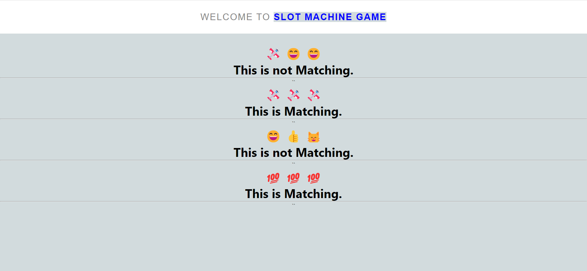

# Slot Machine Game

A basic slot machine game of Emojis created using ReactJS.



## Requirements:

* React Version: **18.2.0**
* Node Version: **18.14.1**
* NPM Version: **9.5.0**

## Instructions:

1. Get the source code on your pc via git.

```shell
  git clone https://github.com/muskanmi/Slot-Machine-Game-ReactJS
```

2.  Navigate inside the folder through your terminal.

```shell
  cd Slot-Machine-Game-ReactJS
```

3. Now, install the required dependencies by running the following command:

```shell
  npm install
```

4. Finally, start the application by running:

```shell
  npm start
```

5. Voila! the application is ready for use. You can access it at [http://localhost:3000](http://localhost:3000).

